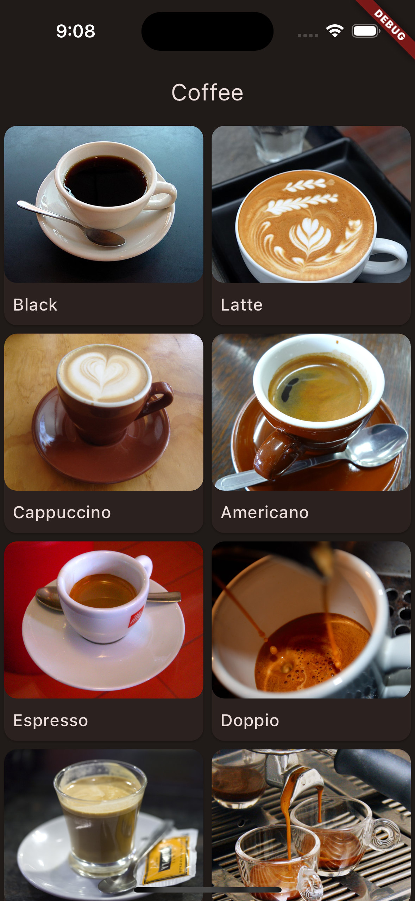
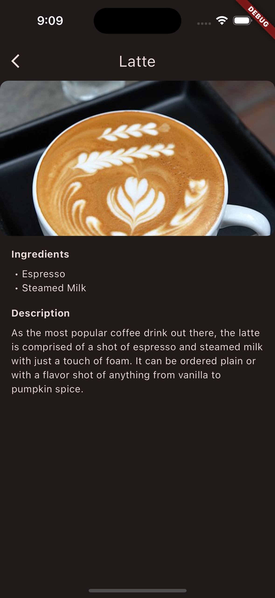

# Flutter Take Home Interview
This interview will test your ability to construct a Flutter app based on design. This app should mimic a shopping experience for personal aircraft. This project includes a sample API with a couple of products that should be used as your data source.

## Submission
1. Create your project inside of this folder
2. When complete please download your source code as a .zip
3. Send this to your interviewer for review

## The Problem
The goal of this test will be to recreate a basic browsing experience. You should show the products provided from the API in a grid view and upon tapping an item show a detail view. You should follow the provided screenshots as closely as possible.

## The API
For this project we are going to be using a sample api that provides us a list of coffee products. The API is included in the `/api` folder and is a simple Node Express app with one endpoint. To run the API locally follow these steps:
1. Ensure you have Node 18 installed
2. Navigate to your api folder `cd api`
3. Install the dependencies `npm install`
4. Run the api locally `npm run dev`

At this point you should see `Coffee api listening on port 3000` in your terminal

You should now be able to access the list of coffee products by hitting this endpoint `http://localhost:3000/coffee`

## Screenshots
Grid View | Detail View
:--------:|:------------:
 | 

## Guidelines
- Use whatever state management you like.
- Design is important so ensure your app looks as close as possible to the given designs
- Although this app is relatively simple. You should organize your project as if it were a large production application.